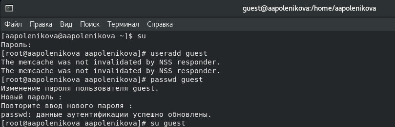
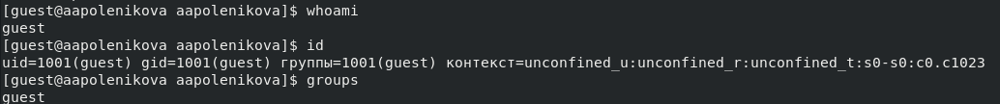
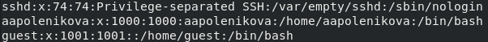
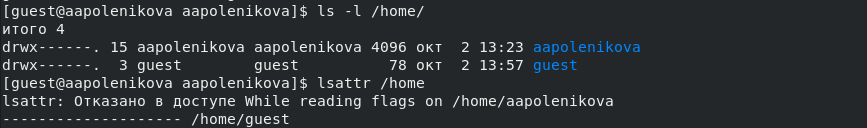
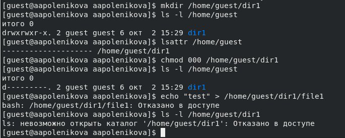
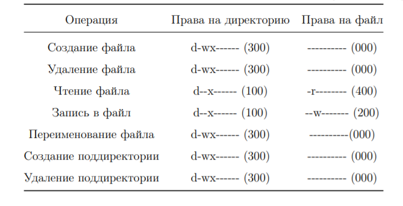

---
## Front matter
lang: ru-RU
title: Лабораторная работа 2. Дискреционное разграничение прав в Linux. Основные атрибуты.
author: |
	 Поленикова Анна Алексеевна\inst{1}

institute: |
	\inst{1}Российский Университет Дружбы Народов

date: Москва, 2021

## Formatting
mainfont: PT Serif
romanfont: PT Serif
sansfont: PT Sans
monofont: PT Mono
toc: false
slide_level: 2
theme: metropolis
header-includes: 
 - \metroset{progressbar=frametitle,sectionpage=progressbar,numbering=fraction}
 - '\makeatletter'
 - '\beamer@ignorenonframefalse'
 - '\makeatother'
aspectratio: 43
section-titles: true

---

# Цели и задачи работы

## Цель лабораторной работы

Получение практических навыков работы в консоли с атрибутами файлов, закрепление теоретических основ дискреционного разграничения доступа в современных системах с открытым кодом на базе ОС Linux.

# Процесс выполнения лабораторной работы

## Создание учетной записи пользователя guest

{ #fig:001 width=70% }

## Определение UID и группы

{ #fig:002 width=70% }

## Файл с данными о пользователях

{ #fig:003 width=70% }

## Атрибуты директории

{ #fig:004 width=70% }

## Работа с директорией dir1

{ #fig:005 width=70% }

## Права и разрешённые действия

{ #fig:005 }

# Выводы по проделанной работе

## Вывод

В результате проделанной лабораторной работы были получены практические навыки работы в консоли с атрибутами файлов, а также закреплены теоретические основы дискреционного разграничения доступа в современных системах с открытым кодом на базе ОС Linux.