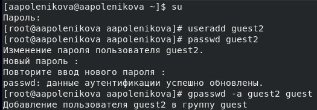
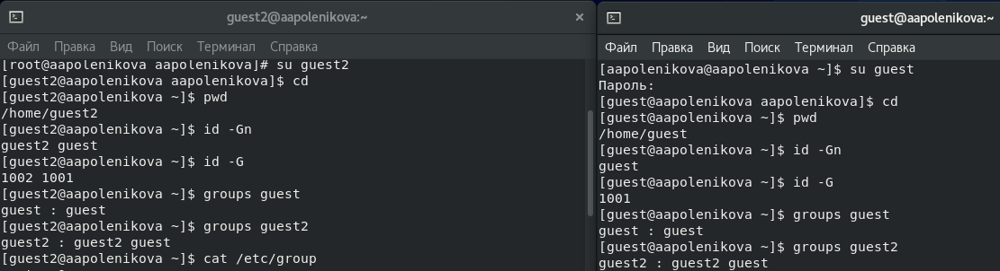
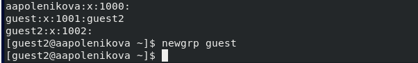
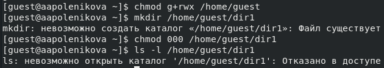
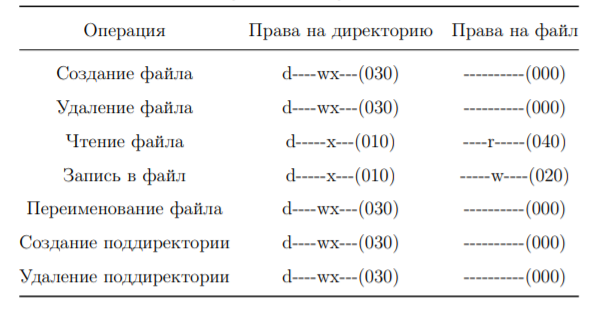

---
## Front matter
lang: ru-RU
title: Лабораторная работа 3. Дискреционное разграничение прав в Linux. Два пользователя.
author: |
	 Поленикова Анна Алексеевна\inst{1}

institute: |
	\inst{1}Российский Университет Дружбы Народов

date: Москва, 2021

## Formatting
mainfont: PT Serif
romanfont: PT Serif
sansfont: PT Sans
monofont: PT Mono
toc: false
slide_level: 2
theme: metropolis
header-includes: 
 - \metroset{progressbar=frametitle,sectionpage=progressbar,numbering=fraction}
 - '\makeatletter'
 - '\beamer@ignorenonframefalse'
 - '\makeatother'
aspectratio: 43
section-titles: true

---

# Цели и задачи работы

## Цель лабораторной работы

Получение практических навыков работы в консоли с атрибутами файлов для групп пользователей.

# Процесс выполнения лабораторной работы

## Создание учетной записи пользователя guest2

{ #fig:001 width=70% }

## Информация о пользователях guest и guest2

{ #fig:002 width=70% }

## Регистрация пользователя guest2 в группе guest

{ #fig:003 width=70% }

## Изменение прав директорий

{ #fig:005 width=70% }

## Минимальные права для совершения операций

{ #fig:005 }

# Выводы по проделанной работе

## Вывод

В результате проделанной лабораторной работы были получены практические навыки работы в консоли с атрибутами файлов для групп пользователей.