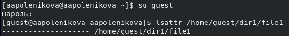
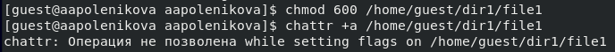
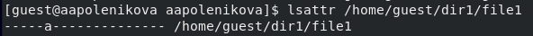
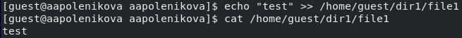
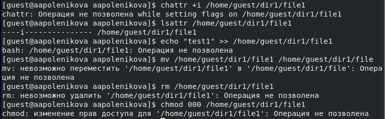

---
# Front matter
lang: ru-RU
title: "Отчет по лабораторной работе №4"
subtitle: "Дискреционное разграничение прав в Linux. Расширенные атрибуты"
author: "Поленикова Анна Алексеевна"

# Formatting
toc-title: "Содержание"
toc: true # Table of contents
toc_depth: 2
lof: true # List of figures
fontsize: 12pt
linestretch: 1.5
papersize: a4paper
documentclass: scrreprt
polyglossia-lang: russian
polyglossia-otherlangs: english
mainfont: PT Serif
romanfont: PT Serif
sansfont: PT Sans
monofont: PT Mono
mainfontoptions: Ligatures=TeX
romanfontoptions: Ligatures=TeX
sansfontoptions: Ligatures=TeX,Scale=MatchLowercase
monofontoptions: Scale=MatchLowercase
indent: true
pdf-engine: lualatex
header-includes:
  - \linepenalty=10 # the penalty added to the badness of each line within a paragraph (no associated penalty node) Increasing the value makes tex try to have fewer lines in the paragraph.
  - \interlinepenalty=0 # value of the penalty (node) added after each line of a paragraph.
  - \hyphenpenalty=50 # the penalty for line breaking at an automatically inserted hyphen
  - \exhyphenpenalty=50 # the penalty for line breaking at an explicit hyphen
  - \binoppenalty=700 # the penalty for breaking a line at a binary operator
  - \relpenalty=500 # the penalty for breaking a line at a relation
  - \clubpenalty=150 # extra penalty for breaking after first line of a paragraph
  - \widowpenalty=150 # extra penalty for breaking before last line of a paragraph
  - \displaywidowpenalty=50 # extra penalty for breaking before last line before a display math
  - \brokenpenalty=100 # extra penalty for page breaking after a hyphenated line
  - \predisplaypenalty=10000 # penalty for breaking before a display
  - \postdisplaypenalty=0 # penalty for breaking after a display
  - \floatingpenalty = 20000 # penalty for splitting an insertion (can only be split footnote in standard LaTeX)
  - \raggedbottom # or \flushbottom
  - \usepackage{float} # keep figures where there are in the text
  - \floatplacement{figure}{H} # keep figures where there are in the text
---

# Цель работы

Цель лабораторной работы №4 - получение практических навыков работы в консоли с расширенными атрибутами файлов.

# Выполнение лабораторной работы

1.	От имени пользователя guest определила расширенные атрибуты файла /home/guest/dir1/file1 командой lsattr /home/guest/dir1/file1.

{ #fig:001 width=70% }

2.	Установила командой chmod 600 file1 на файл file1 права, разрешающие чтение и запись для владельца файла. Попробовала установить на файл /home/guest/dir1/file1 расширенный атрибут a от имени пользователя guest с помощью команды chattr +a /home/guest/dir1/file1.
В ответ был получен отказ от выполнения операции.

{ #fig:001 width=70% }

3.	Зашла в другом окне консоли с правами администратора и попровала установить расширенный атрибут a на файл /home/guest/dir1/file1 от имени суперпользователя с помощью команды chattr +a /home/guest/dir1/file1.

{ #fig:003 width=70% }

4.	От пользователя guest проверила правильность установления атрибута с помощью команды lsattr /home/guest/dir1/file1.

{ #fig:002 width=70% }

5.	Выполнила дозапись в файл file1 слова «test» командой echo >> "test" /home/guest/dir1/file1. После этого выполнила чтение файла file1 командой cat /home/guest/dir1/file1.  Убедилась, что слово test было успешно записано в file1.

{ #fig:002 width=70% }

6.	Попробовала удалить и переименовать файл file1. В обоих случаях был получен отказ от выполнения операции.

{ #fig:003 width=70% }

7.	Попробовала с помощью команды chmod 000 file1 установить на файл file1 права, запрещающие чтение и запись для владельца файла. При выполнении команды был получен отказ от выполнения операции.

{ #fig:003 width=70% }

8.	Сняла расширенный атрибут a с файла /home/guest/dirl/file1 от имени суперпользователя командой chattr -a /home/guest/dir1/file1.

{ #fig:003 width=70% }

После повторила операции, которые ранее не удалось выполнить. Все операции были выполнены успешно.

{ #fig:004 width=70% }

9.	Повторила все действия по шагам, заменив атрибут «a» атрибутом «i». При этом дозаписать информации в файл не удалось в связи с отказом от выполнения операции.

{ #fig:004 width=70% }

# Вывод

В ходе выполнения лабораторной работы были получены практические навыки работы в консоли с расширенными атрибутами файлов.