---
## Front matter
lang: ru-RU
title: Лабораторная работа 5. Дискреционное разграничение прав в Linux. Исследование влияния дополнительных атрибутов.
author: |
	 Поленикова Анна Алексеевна\inst{1}

institute: |
	\inst{1}Российский Университет Дружбы Народов

date: Москва, 2021

## Formatting
mainfont: PT Serif
romanfont: PT Serif
sansfont: PT Sans
monofont: PT Mono
toc: false
slide_level: 2
theme: metropolis
header-includes: 
 - \metroset{progressbar=frametitle,sectionpage=progressbar,numbering=fraction}
 - '\makeatletter'
 - '\beamer@ignorenonframefalse'
 - '\makeatother'
aspectratio: 43
section-titles: true

---

# Цели и задачи работы

## Цель лабораторной работы

Изучение механизмов изменения идентификаторов, применения SetUID- и Sticky-битов. Получение практических навыков работы в консоли с дополнительными атрибутами. Рассмотрение работы механизма смены идентификатора процессов пользователей, а также влияние бита Sticky на запись и удаление файлов.

# Процесс выполнения лабораторной работы

## Подготовка лабораторного стенда

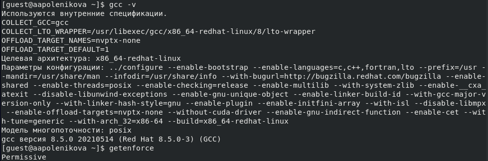{ #fig:001 width=70% }

## Создание программы simpleid.c

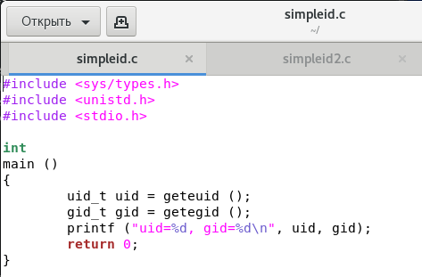{ #fig:002 width=70% }

## Компиляция и выполнение программы simpleid

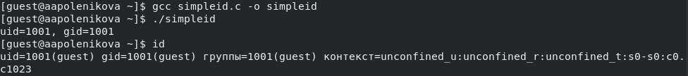{ #fig:003 width=70% }

## Создание программы simpleid2.c

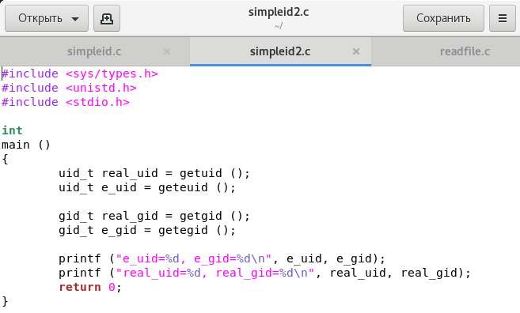{ #fig:004 width=70% }

## Компиляция и выполнение программы simpleid2

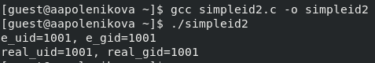{ #fig:005 width=70% }

## Изменение владельца и атрибутов simpleid2

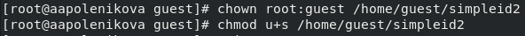{ #fig:006 width=70% }

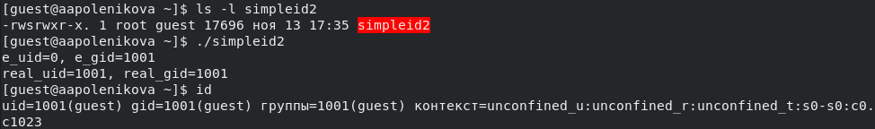{ #fig:007 width=70% }

## Повторение операций для SetGID-бита

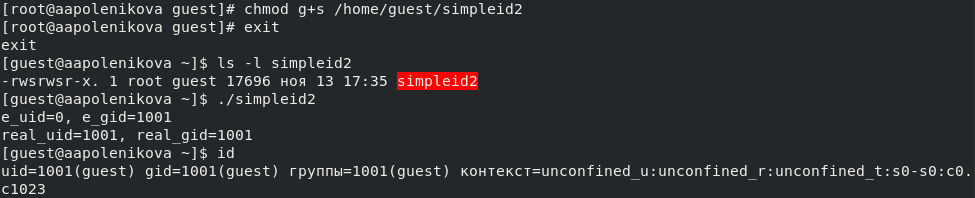{ #fig:008 width=70% }

## Создание программы readfile.c

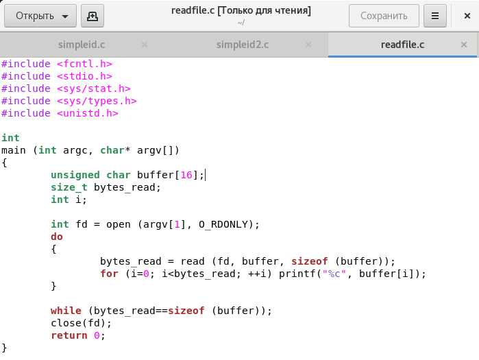{ #fig:009 width=70% }

## Компиляция. Смена владельца и изменение прав файла readfile.c

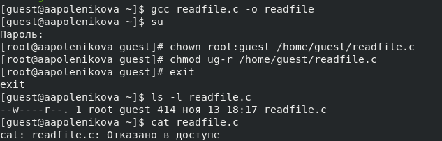{ #fig:010 width=70% }

## Операции с программой readfile

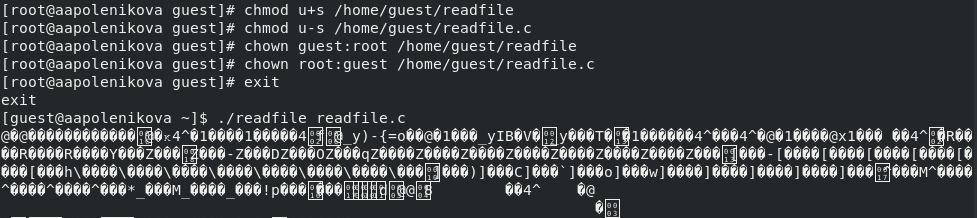{ #fig:011 width=70% }

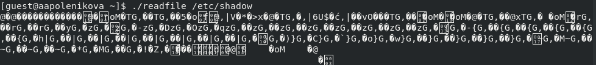{ #fig:012 width=70% }

## Проверка Sticky атрибута. Создание файла file1

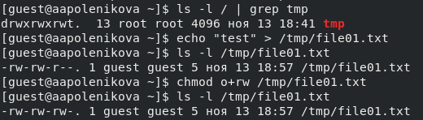{ #fig:013 width=70% }

## Операции с файлом file01.txt

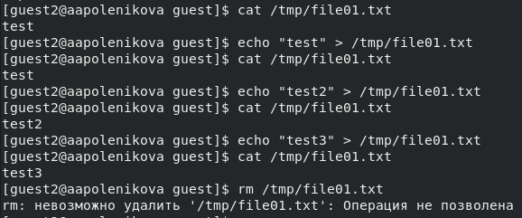{ #fig:014 width=70% }

## Снятие t атрибута с директории /tmp

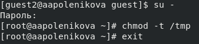{ #fig:015 width=70% }

## Операции с файлом file01.txt после снятия t атрибута

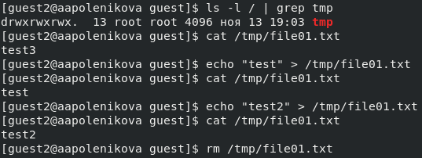{ #fig:016 width=70% }

## Возвращение t атрибута директории /tmp

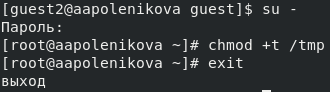{ #fig:017 width=70% }

# Выводы по проделанной работе

## Вывод

В результате проделанной лабораторной работы были изучены механизмы изменения идентификаторов, применения SetUID- и Sticky-битов, получены практические навыки работы в консоли с дополнительными атрибутами, а также рассмотрены работы механизма смены идентификатора процессов пользователей и влияние бита Sticky на запись и удаление файлов.