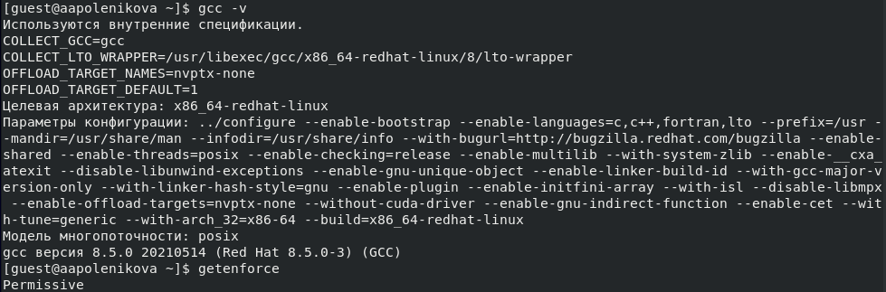
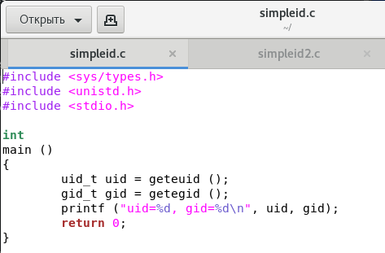
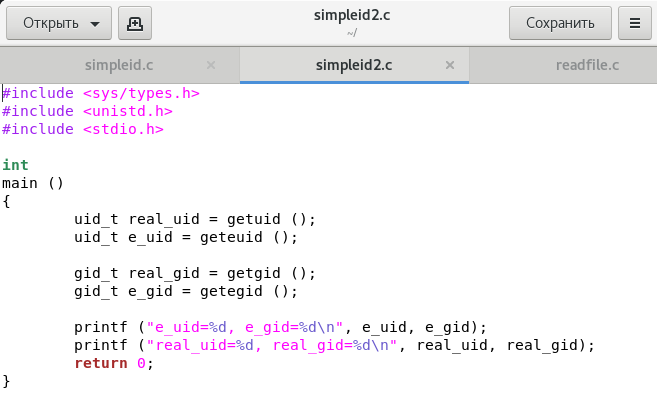
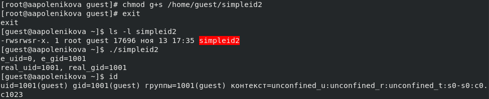
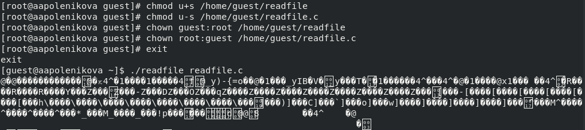
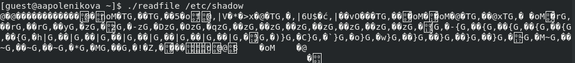
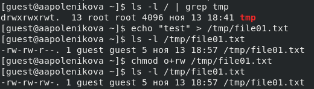
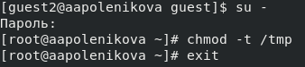
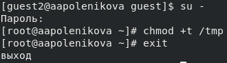

---
# Front matter
lang: ru-RU
title: "Отчет по лабораторной работе №5"
subtitle: "Дискреционное разграничение прав в Linux. Исследование влияния дополнительных атрибутов"
author: "Поленикова Анна Алексеевна"

# Formatting
toc-title: "Содержание"
toc: true # Table of contents
toc_depth: 2
lof: true # List of figures
fontsize: 12pt
linestretch: 1.5
papersize: a4paper
documentclass: scrreprt
polyglossia-lang: russian
polyglossia-otherlangs: english
mainfont: PT Serif
romanfont: PT Serif
sansfont: PT Sans
monofont: PT Mono
mainfontoptions: Ligatures=TeX
romanfontoptions: Ligatures=TeX
sansfontoptions: Ligatures=TeX,Scale=MatchLowercase
monofontoptions: Scale=MatchLowercase
indent: true
pdf-engine: lualatex
header-includes:
  - \linepenalty=10 # the penalty added to the badness of each line within a paragraph (no associated penalty node) Increasing the value makes tex try to have fewer lines in the paragraph.
  - \interlinepenalty=0 # value of the penalty (node) added after each line of a paragraph.
  - \hyphenpenalty=50 # the penalty for line breaking at an automatically inserted hyphen
  - \exhyphenpenalty=50 # the penalty for line breaking at an explicit hyphen
  - \binoppenalty=700 # the penalty for breaking a line at a binary operator
  - \relpenalty=500 # the penalty for breaking a line at a relation
  - \clubpenalty=150 # extra penalty for breaking after first line of a paragraph
  - \widowpenalty=150 # extra penalty for breaking before last line of a paragraph
  - \displaywidowpenalty=50 # extra penalty for breaking before last line before a display math
  - \brokenpenalty=100 # extra penalty for page breaking after a hyphenated line
  - \predisplaypenalty=10000 # penalty for breaking before a display
  - \postdisplaypenalty=0 # penalty for breaking after a display
  - \floatingpenalty = 20000 # penalty for splitting an insertion (can only be split footnote in standard LaTeX)
  - \raggedbottom # or \flushbottom
  - \usepackage{float} # keep figures where there are in the text
  - \floatplacement{figure}{H} # keep figures where there are in the text
---

# Цель работы

Изучение механизмов изменения идентификаторов, применения SetUID- и Sticky-битов. Получение практических навыков работы в консоли с дополнительными атрибутами. Рассмотрение работы механизма смены идентификатора процессов пользователей, а также влияние бита Sticky на запись и удаление файлов.

# Выполнение лабораторной работы

## Подготовка лабораторного стенда

1.	Убедилась, что в системе установлен компилятор gcc, введя команду gcc -v. Также проверила отключение систему запретов до очередной перезагрузки системы 
командой getenforce, которая вывела Permissive.

{ #fig:001 width=70% }

## Создание программы

1.	Вошла в систему от имени пользователя guest и создала программу simpleid.c со следующим кодом:

{ #fig:002 width=70% }

2.	Скомпилировала программу с помощью команды gcc simpleid.c -o simpleid и убедилась, что файл программы создан. 
Выполнила программу simpleid, а также системную программу id. Результат выполнения двух последних программ одинаков.

{ #fig:003 width=70% }

3.	Усложнила программу, добавив вывод действительных идентификаторов и назвала получившуюся программу simpleid2.c.

{ #fig:004 width=70% }

4.	Скомпилировала и запустила simpleid2.c.

{ #fig:005 width=70% }

5.	От имени суперпользователя выполните команды chown root:guest /home/guest/simpleid2 и chmod u+s /home/guest/simpleid2, повысив права пользователя с помощью команды su и изменив владельца и атрибуты simpleid2.

{ #fig:006 width=70% }

6.	Выполнила проверку правильности установки новых атрибутов и смены владельца файла simpleid2 командой ls -l simpleid2, а также запустила simpleid2 и id. Результат выполнения программ отличается, поскольку программа simpleid2 выводит uid и gid владельца, а команда id - uid и gid текущего пользователя.

{ #fig:007 width=70% }

7.	Проделала то же самое относительно SetGID-бита.

{ #fig:008 width=70% }

8.	Создала программу readfile.c.

{ #fig:009 width=70% }

9.	Откомпилируйте программу с помощью команды gcc readfile.c -o readfile. После от имени администратора сменила владельца у файла readfile.c и изменила права так, чтобы только суперпользователь (root) мог прочитать его, a guest не мог. Проверила, что пользователь guest не может прочитать файл readfile.c.

{ #fig:010 width=70% }

10.	Сменила у программы readfile владельца и установила SetUID-бит. Выяснила, что программа readfile не может прочитать файл readfile.c.

{ #fig:011 width=70% }

11.	Также выяснила, что программа readfile не может прочитать файл /etc/shadow.

{ #fig:012 width=70% }

## Исследование Sticky-бита

1.	Выяснила, установлен ли атрибут Sticky на директории /tmp, для чего выполнила команду ls -l / | grep tmp. Атрибут установлен. От имени пользователя guest создала файл file01.txt в директории /tmp со словом test с помощью команды echo "test" > /tmp/file01.txt. После просмотрела атрибуты у только что созданного файла и разрешила чтение и запись для категории пользователей «все остальные» с помощью команд ls -l /tmp/file01.txt, chmod o+rw /tmp/file01.txt и ls -l /tmp/file01.txt.

{ #fig:013 width=70% }

2.	От пользователя guest2 (не являющегося владельцем) попробовала прочитать файл /tmp/file01.txt с помощью команды cat /tmp/file01.txt. После попробовала дозаписать в файл /tmp/file01.txt слово test2 командой echo "test2" > /tmp/file01.txt. Проверила содержимое файла командой cat /tmp/file01.txt. Далее попробовала записать в файл /tmp/file01.txt слово test3, стерев при этом всю имеющуюся в файле информацию командой echo "test3" > /tmp/file01.txt. Снова проверила содержимое файла командой cat /tmp/file01.txt. Попробовала удалить файл /tmp/file01.txt командой rm /tmp/fileOl.txt. Получилось выполнить все команды на запись и чтение, но не команду удаления файла.

{ #fig:014 width=70% }

3.	Повысила свои права до суперпользователя командой su - и выполнила команду chmod -t /tmp, снимающую атрибут t (Sticky-бит) с директории /tmp. Покинула режим суперпользователя командой exit.

{ #fig:015 width=70% }

4.	От пользователя guest2 проверила командой ls -l / | grep tmp, что атрибута t у директории /tmp нет. Повторила предыдущие шаги, причем в этот раз удалось удалить файл от имени пользователя, не являющегося владельцем файла file01.txt.

{ #fig:016 width=70% }

5.	Повысила свои права до суперпользователя и вернула атрибут t на директорию /tmp.

{ #fig:017 width=70% }

# Вывод

В ходе выполнения лабораторной работы были изучены механизмы изменения идентификаторов, применения SetUID- и Sticky-битов, получены практические навыки работы в консоли с дополнительными атрибутами, а также рассмотрены работы механизма смены идентификатора процессов пользователей и влияние бита Sticky на запись и удаление файлов.