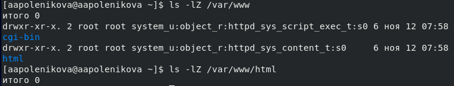

---
## Front matter
lang: ru-RU
title: Лабораторная работа 6. Мандатное разграничение прав в Linux.
author: |
	 Поленикова Анна Алексеевна\inst{1}

institute: |
	\inst{1}Российский Университет Дружбы Народов

date: Москва, 2021

## Formatting
mainfont: PT Serif
romanfont: PT Serif
sansfont: PT Sans
monofont: PT Mono
toc: false
slide_level: 2
theme: metropolis
header-includes: 
 - \metroset{progressbar=frametitle,sectionpage=progressbar,numbering=fraction}
 - '\makeatletter'
 - '\beamer@ignorenonframefalse'
 - '\makeatother'
aspectratio: 43
section-titles: true

---

# Цели и задачи работы

## Цель лабораторной работы

Развитие навыков администрирования ОС Linux, первое практическое знакомство с технологией SELinux, а также проверка работы SELinx на практике совместно с веб-сервером Apache.

# Процесс выполнения лабораторной работы

## Проверка работы SELinux и веб-сервера

{ #fig:001 width=70% }

## Веб-сервер Apache

{ #fig:002 width=70% }

## Состояние переключателей SELinux

{ #fig:003 width=70% }

## Команда seinfo

{ #fig:004 width=70% }

## Тип файлов и поддиректорий

{ #fig:005 width=70% }

## Создание html-файла /var/www/html/test.html

{ #fig:006 width=70% }

## Обращение к файлу test.html

{ #fig:007 width=70% }

## Контекст файла test.html

{ #fig:008 width=70% }

## log-файлы веб-сервера Apache и системный log-файл

{ #fig:009 width=70% }

## Запуск веб-сервера Apache на прослушивание ТСР-порта 81

{ #fig:010 width=70% }

## Вывод списка портов

{ #fig:011 width=70% }

## Возвращение контекста

{ #fig:012 width=70% }

# Выводы по проделанной работе

## Вывод

В результате проделанной лабораторной работы были развиты навыки администрирования ОС Linux, получено первое практическое знакомство с технологией SELinux, а также была проверена работа SELinux на практике совместно с веб-сервером Apache.