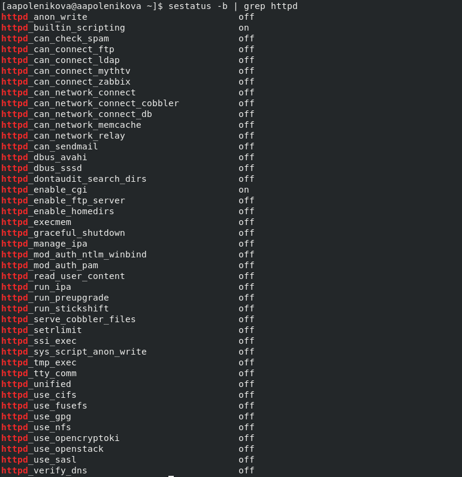
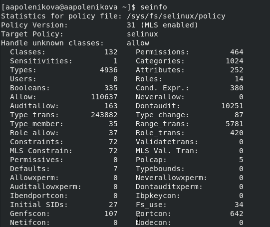
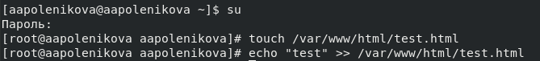
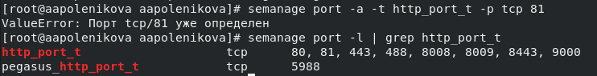
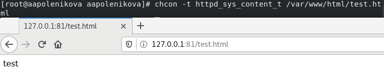

---
# Front matter
lang: ru-RU
title: "Отчет по лабораторной работе №6"
subtitle: "Мандатное разграничение прав в Linux"
author: "Поленикова Анна Алексеевна"

# Formatting
toc-title: "Содержание"
toc: true # Table of contents
toc_depth: 2
lof: true # List of figures
fontsize: 12pt
linestretch: 1.5
papersize: a4paper
documentclass: scrreprt
polyglossia-lang: russian
polyglossia-otherlangs: english
mainfont: PT Serif
romanfont: PT Serif
sansfont: PT Sans
monofont: PT Mono
mainfontoptions: Ligatures=TeX
romanfontoptions: Ligatures=TeX
sansfontoptions: Ligatures=TeX,Scale=MatchLowercase
monofontoptions: Scale=MatchLowercase
indent: true
pdf-engine: lualatex
header-includes:
  - \linepenalty=10 # the penalty added to the badness of each line within a paragraph (no associated penalty node) Increasing the value makes tex try to have fewer lines in the paragraph.
  - \interlinepenalty=0 # value of the penalty (node) added after each line of a paragraph.
  - \hyphenpenalty=50 # the penalty for line breaking at an automatically inserted hyphen
  - \exhyphenpenalty=50 # the penalty for line breaking at an explicit hyphen
  - \binoppenalty=700 # the penalty for breaking a line at a binary operator
  - \relpenalty=500 # the penalty for breaking a line at a relation
  - \clubpenalty=150 # extra penalty for breaking after first line of a paragraph
  - \widowpenalty=150 # extra penalty for breaking before last line of a paragraph
  - \displaywidowpenalty=50 # extra penalty for breaking before last line before a display math
  - \brokenpenalty=100 # extra penalty for page breaking after a hyphenated line
  - \predisplaypenalty=10000 # penalty for breaking before a display
  - \postdisplaypenalty=0 # penalty for breaking after a display
  - \floatingpenalty = 20000 # penalty for splitting an insertion (can only be split footnote in standard LaTeX)
  - \raggedbottom # or \flushbottom
  - \usepackage{float} # keep figures where there are in the text
  - \floatplacement{figure}{H} # keep figures where there are in the text
---

# Цель работы

Развить навыки администрирования ОС Linux. Получить первое практическое знакомство с технологией SELinux.
Проверить работу SELinx на практике совместно с веб-сервером Apache.

# Выполнение лабораторной работы

1.	Вошла в систему и убедилась, что SELinux работает в режиме enforcing политики targeted с помощью команд getenforce и sestatus. Обратилась к веб-серверу, запущенному на компьютере, и убедилась, что последний работает с помощью команды service httpd status.

{ #fig:001 width=70% }

2. Нашла веб-сервер Apache в списке процессов и определила его контекст безопасности, использовав команду ps auxZ | grep httpd.

{ #fig:002 width=70% }

3.	Посмотрела текущее состояние переключателей SELinux для Apache с помощью команды sestatus -b | grep httpd. Многие из них находятся в положении «off».

{ #fig:003 width=70% }

4.	Посмотрела статистику по политике с помощью команды seinfo и определила множество пользователей, ролей, типов.

{ #fig:004 width=70% }

5.	Определила тип файлов и поддиректорий, находящихся в директории /var/www, с помощью команды ls -lZ /var/www. Определила тип файлов, находящихся в директории /var/www/html с помощью команды ls -lZ /var/www/html. Создание файлов в директории /var/www/html разрешено только root пользователю.

{ #fig:005 width=70% }

6.	Создала от имени суперпользователя html-файл /var/www/html/test.html следующего содержания:
<html>
<body>test</body>
</html>

{ #fig:006 width=70% }

7.	Обратилась к файлу через веб-сервер, введя в браузере адрес http://127.0.0.1/test.html. Файл был успешно отображён.

{ #fig:007 width=70% }

8.	Изучила справку man httpd_selinux и выяснила, какие контексты файлов определены для httpd. Проверила контекст файла ls -Z /var/www/html/test.html. При выполнении команды был получен контекст httpd_sys_content_t, который позволяет процессу httpd получить доступ к файлу. Изменила контекст файла /var/www/html/test.html с
httpd_sys_content_t на samba_share_t с помощью команды chcon -t samba_share_t /var/www/html/test.html и проверила, что контекст поменялся с помощью команды ls -Z /var/www/html/test.html.

{ #fig:008 width=70% }

9.	Попробовала ещё раз получить доступ к файлу через веб-сервер, введя в браузере адрес http://127.0.0.1/test.html. При выполнении команды получила
сообщение об ошибке:
Forbidden
You don't have permission to access /test.html on this server.

10.	Просмотрела log-файлы веб-сервера Apache с помощью команды ls -l /var/www/html/test.html. Также просмотрела системный лог-файл командой tail /var/log/messages.

{ #fig:009 width=70% }

11.	Попробовала запустить веб-сервер Apache на прослушивание ТСР-порта 81 (а не 80, как рекомендует IANA и прописано в /etc/services). Для
этого в файле /etc/httpd/httpd.conf нашла строчку Listen 80 и заменила её на Listen 81.

{ #fig:010 width=70% }

12.	Выполнила перезапуск веб-сервера Apache, при этом сбоя не произошло, поскольку порт 81 уже был определен.

13.	Проанализировала лог-файлы с помощью команды tail -nl /var/log/messages. Просмотрела файлы /var/log/http/error_log, /var/log/http/access_log и /var/log/audit/audit.log.

14.	Выполнила команду semanage port -a -t http_port_t -р tcp 81. После этого проверила список портов командой semanage port -l | grep http_port_t. Порт 81 в списке.

{ #fig:011 width=70% }

15.	Вернула контекст httpd_sys_cоntent_t к файлу /var/www/html/test.html командой chcon -t httpd_sys_content_t /var/www/html/test.html. После этого попробовала получить доступ к файлу через веб-сервер, введя в браузере адрес http://127.0.0.1:81/test.html.

{ #fig:012 width=70% }

16.	Исправила обратно конфигурационный файл apache, вернув Listen 80.

17. Удалила привязку http_port_t к 81 порту командой semanage port -d -t http_port_t -p tcp 81.

18. Удалила файл /var/www/html/test.html командой rm /var/www/html/test.html.

# Вывод

В ходе выполнения лабораторной работы были развиты навыки администрирования ОС Linux, получено первое практическое знакомство с технологией SELinux, а также была проверена работа SELinux на практике совместно с веб-сервером Apache.