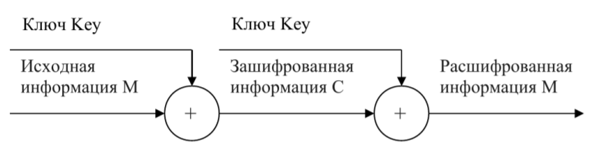
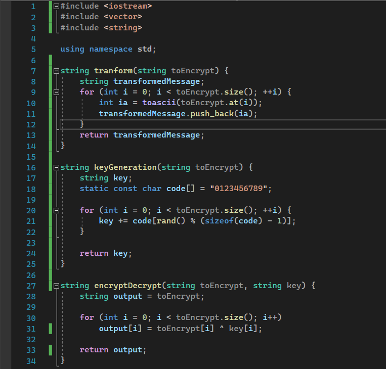
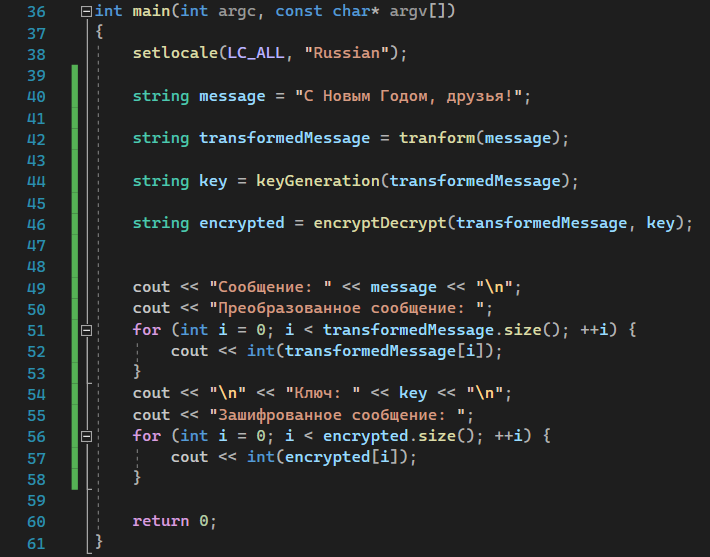
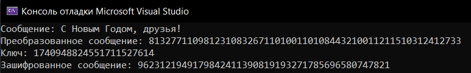

---
## Front matter
lang: ru-RU
title: Лабораторная работа 7. Элементы криптографии. Однократное гаммирование.
author: |
	 Поленикова Анна Алексеевна\inst{1}

institute: |
	\inst{1}Российский Университет Дружбы Народов

date: Москва, 2021

## Formatting
mainfont: PT Serif
romanfont: PT Serif
sansfont: PT Sans
monofont: PT Mono
toc: false
slide_level: 2
theme: metropolis
header-includes: 
 - \metroset{progressbar=frametitle,sectionpage=progressbar,numbering=fraction}
 - '\makeatletter'
 - '\beamer@ignorenonframefalse'
 - '\makeatother'
aspectratio: 43
section-titles: true

---

# Цели и задачи работы

## Цель лабораторной работы

Освоить на практике применение режима однократного гаммирования.

# Теоретическая справка

## Теоретическая справка

Гаммирование представляет собой наложение (снятие) на открытые (зашифрованные) данные последовательности элементов других данных, полученной с помощью некоторого криптографического алгоритма, для получения зашифрованных (открытых) данных. Иными словами, наложение
гаммы — это сложение её элементов с элементами открытого (закрытого)
текста по некоторому фиксированному модулю, значение которого представляет собой известную часть алгоритма шифрования.
В соответствии с теорией криптоанализа, если в методе шифрования используется однократная вероятностная гамма (однократное гаммирование)
той же длины, что и подлежащий сокрытию текст, то текст нельзя раскрыть.
Даже при раскрытии части последовательности гаммы нельзя получить информацию о всём скрываемом тексте.
Наложение гаммы по сути представляет собой выполнение операции
сложения по модулю 2 (XOR) (обозначаемая знаком $\oplus$) между элементами
гаммы и элементами подлежащего сокрытию текста. Напомним, как работает операция XOR над битами: $0 \oplus 0 = 0$, $0 \oplus 1 = 1$, $1 \oplus 0 = 1$, $1 \oplus 1 = 0$.
Такой метод шифрования является симметричным, так как двойное прибавление одной и той же величины по модулю 2 восстанавливает исходное

{ #fig:001 width=70% }

значение, а шифрование и расшифрование выполняется одной и той же программой.
Если известны ключ и открытый текст, то задача нахождения шифротекста заключается в применении к каждому символу открытого текста следующего правила:
$$C_{i} = P_{i} \oplus K_{i}$$, 
где $C_{i}$ — i-й символ получившегося зашифрованного послания, $P_{i}$ — i-й
символ открытого текста, $K_{i}$ — i-й символ ключа, $i = 1, m$. Размерности
открытого текста и ключа должны совпадать, и полученный шифротекст
будет такой же длины.
Если известны шифротекст и открытый текст, то задача нахождения
ключа решается также в соответствии с (7.1), а именно, обе части равенства необходимо сложить по модулю 2 с $P_{i}$:
$$C_{i} \oplus P_{i} = P_{i} \oplus K_{i} \oplus P_{i} = K_{i},$$ $$K_{i} = C_{i} \oplus P_{i}$$
Открытый текст имеет символьный вид, а ключ — шестнадцатеричное
представление. Ключ также можно представить в символьном виде, воспользовавшись таблицей ASCII-кодов.
К. Шеннон доказал абсолютную стойкость шифра в случае, когда однократно используемый ключ, длиной, равной длине исходного сообщения,
является фрагментом истинно случайной двоичной последовательности с
равномерным законом распределения. Криптоалгоритм не даёт никакой информации об открытом тексте: при известном зашифрованном сообщении
C все различные ключевые последовательности K возможны и равновероятны, а значит, возможны и любые сообщения P.
Необходимые и достаточные условия абсолютной стойкости шифра:
– полная случайность ключа;
– равенство длин ключа и открытого текста;
– однократное использование ключа.

# Процесс выполнения лабораторной работы

## Функции программы-шифратора

{ #fig:002 width=70% }

## main функция программы-шифратора

{ #fig:003 width=70% }

## Результат работы программы-шифратора

{ #fig:004 width=70% }

# Выводы по проделанной работе

## Вывод

В ходе выполнения лабораторной работы было освоено на практике применение режима однократного гаммирования.